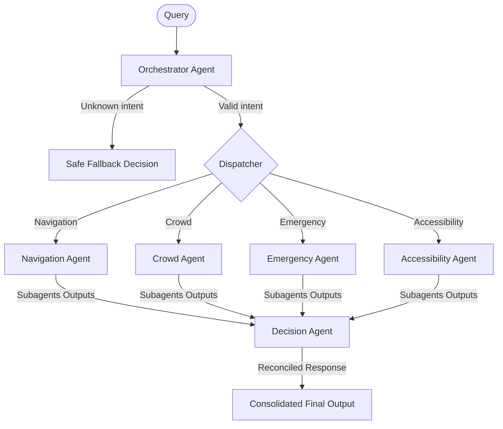

# StadiumBrain AI: Multi-Agent Core

This document details the responsibilities, execution rules, and collaboration patterns of the AI sub-agents in StadiumBrain.

## Multi-Agent Organization

StadiumBrain uses a hierarchical multi-agent framework to solve operational command queries. Rather than routing all data through a single large language model, the system distributes processing to specialised sub-agents.

## Agent Definitions

### 1. Central Orchestrator Agent (`backend/agents/orchestrator.py`)
- **Responsibility**: Analyzes incoming query commands, detects intent, and determines which sub-agents must be invoked.
- **Intent Options**: `navigation`, `crowd`, `emergency`, `accessibility`, `multiple`, or `unknown`.
- **Safety Fallback**: Implements keyword heuristic fallback parser. If Gemini API is configured improperly or fails, the orchestrator still returns accurate selected agents based on token rules, ensuring system stays active.

### 2. Navigation Agent (`backend/agents/navigation_agent.py`)
- **Responsibility**: Calculates routes, entrance gate direction recommendations, and walking times.
- **Outputs**: Best gate (Gate A-D), walking time, route load density, and routing status metadata.

### 3. Crowd Intelligence Agent (`backend/agents/crowd_agent.py`)
- **Responsibility**: Assesses crowd flow rates, section capacity warnings, and zone congestion density loads.
- **Outputs**: Zone name, crowd level (Low, Medium, High, Critical), capacity predictions.

### 4. Emergency Response Agent (`backend/agents/emergency_agent.py`)
- **Responsibility**: Processes security alerts, fire hazards, medical collapses, lost kids, or utility issues.
- **Outputs**: Priority (Low, Medium, High, Critical), recommended dispatch action details, and ETA for help arrival.

### 5. Accessibility Agent (`backend/agents/accessibility_agent.py`)
- **Responsibility**: Coordinates elevator checks, wheelchair routes, shuttle cart needs, and barrier-free pathways.
- **Outputs**: Accessibility routing path, elevator/escalator status warning arrays.

### 6. Central Decision Agent (`backend/agents/decision_agent.py`)
- **Responsibility**: Consolidates sub-agent outputs, resolves conflicts (e.g., if Navigation suggests a route that Crowd identifies as blocked), and yields a single priority directive.
