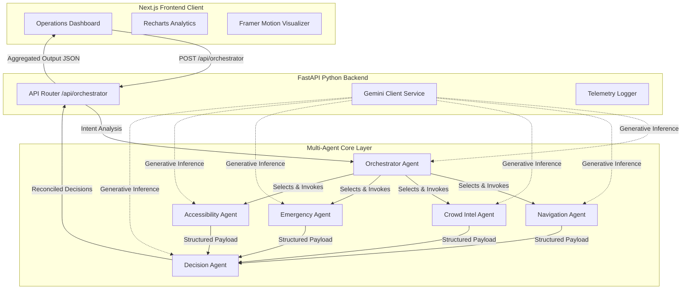

# StadiumBrain AI: System Architecture

This document describes the high-level system architecture and request flow patterns of the StadiumBrain AI Operations Command Center.

## Overall Architecture

StadiumBrain AI operates as a decoupled, multi-agent command structure combining a responsive Next.js frontend console with a FastAPI-driven Python backend.

## Technology Stack

### Frontend Command Console
- **Framework**: Next.js 15 (App Router, Turbopack)
- **Styling**: Vanilla CSS variables with custom styling systems (Dark theme, glassmorphism, responsive flex layouts)
- **Widgets**:
  - `recharts`: Canvas charting and metrics visualization.
  - `framer-motion`: Transition animations, agent tracing nodes, and interactive element triggers.
  - `lucide-react`: Operator-grade icon telemetry.

### Backend Orchestration Core
- **Framework**: FastAPI (Asynchronous framework & Pydantic response modeling)
- **AI Inference SDK**: Google Generative AI Python Client SDK (`google-generativeai`)
- **Testing**: `pytest` and `httpx` (Integration routing assertion client)
- **Validation**: Pydantic schema validation.

## Key Design Principles
1. **Decoupled Isolation**: The frontend remains completely state-isolated, allowing real-time mock telemetry to operate gracefully even if backend network gateways experience transient timeouts.
2. **Sub-Agent Containment**: Sub-agents execute inside insulated try-catch contexts. A failure in navigation or crowd calculations does not obstruct emergency dispatches or cause overall pipeline crashes.
3. **Strict JSON Schema Enforcement**: AI prompts include explicit schemas, ensuring JSON outputs are compliant with Pydantic response models.
