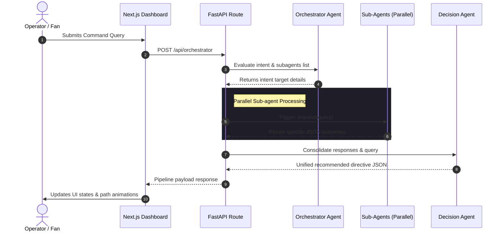

# StadiumBrain AI: Agent Execution Workflow

This document traces the path of a query through the Orchestrator pipeline.

## Execution Sequence Diagram

```mermaid
sequenceDiagram
    autonumber
    actor Operator as Operator / Fan
    participant FE as Next.js Dashboard
    participant BE as FastAPI Route
    participant Orch as Orchestrator Agent
    participant Sub as Sub-Agents (Parallel)
    participant Dec as Decision Agent

    Operator->>FE: Submits Command Query
    FE->>BE: POST /api/orchestrator
    BE->>Orch: Evaluate intent & subagents list
    Orch-->>BE: Returns intent target details
    
    rect rgb(30, 30, 40)
        note right of BE: Parallel Sub-agent Processing
        BE->>Sub: Trigger process(query)
        Sub-->>BE: Return specific JSON outcomes
    end
    
    BE->>Dec: Consolidate responses & query
    Dec-->>BE: Unified recommended directive JSON
    BE-->>FE: Pipeline payload response
    FE->>Operator: Updates UI states & path animations
```
